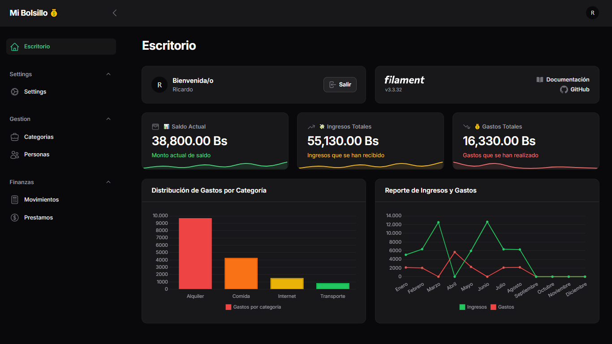
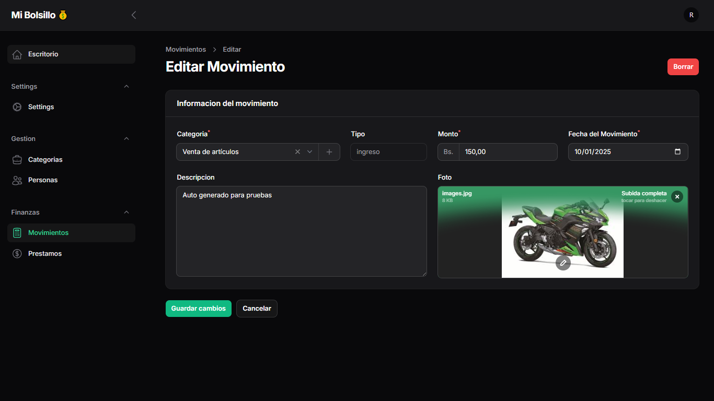
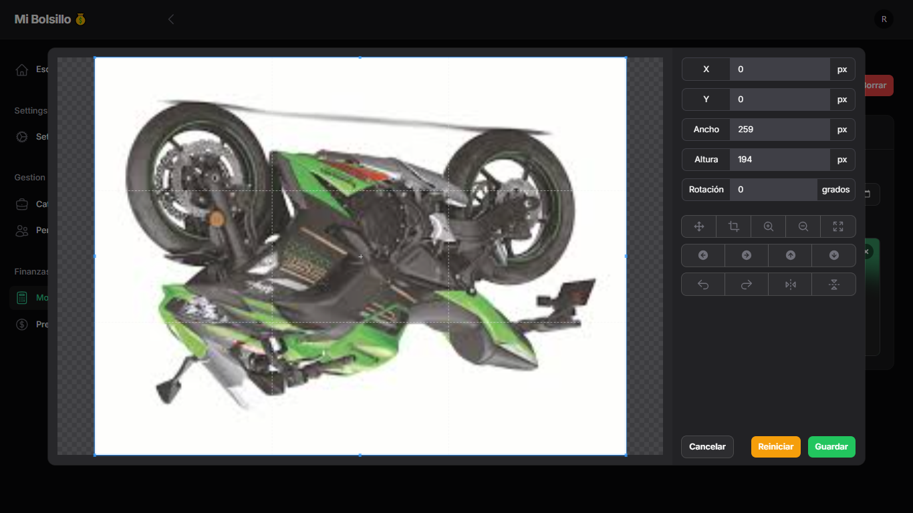
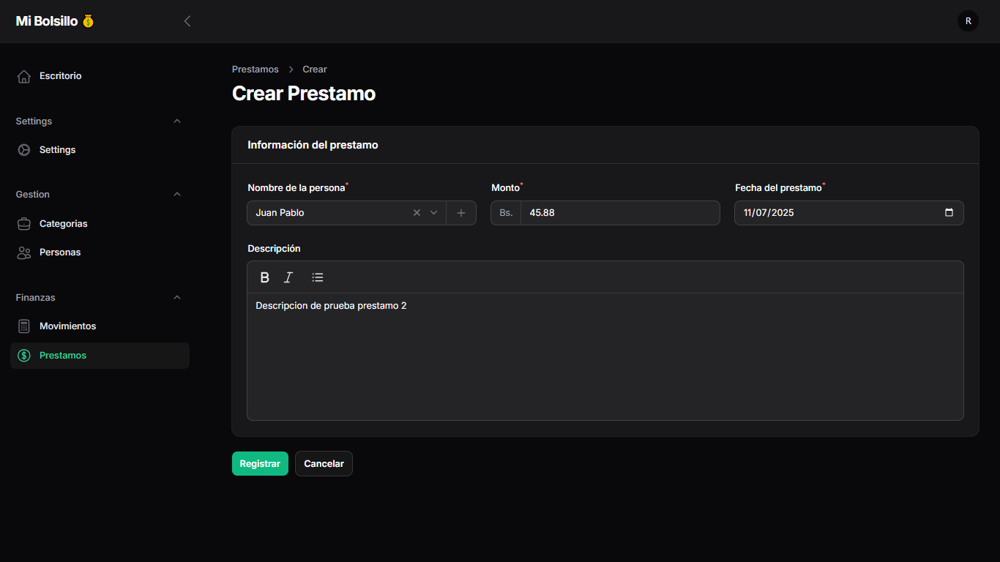
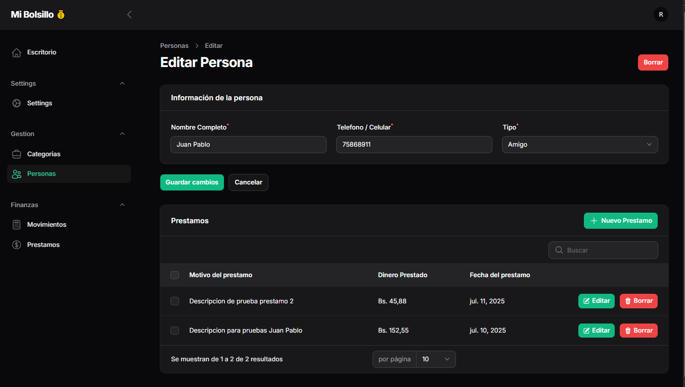

# 🎒 Mi Bolsillo

**Mi Bolsillo** es tu compañero ideal para manejar tus finanzas personales 💰. Una PWA súper fácil de usar para registrar tus ingresos, gastos y préstamos 📈. ¡Organiza tu dinero y toma control con solo unos clics!

---

## 🚀 Funcionalidades clave

- 📝 **Registro y edición de movimientos:** Controla tus ingresos y gastos, con la opción de adjuntar imágenes para más detalle.
- 🤝 **Gestión de préstamos:** Registra a las personas a quienes prestas dinero y lleva un seguimiento claro.
- 📊 **Dashboard dinámico:** Visualiza gráficos interactivos para entender mejor tus finanzas.
- 👥 **Relación de personas y movimientos:** Ve todos los movimientos y préstamos asociados a cada persona.
- 📱 **PWA:** Usa la app desde cualquier dispositivo, ¡sin complicaciones!

---

## 📸 Capturas de pantalla

### 🏠 Dashboard


Visualiza un resumen claro de tus gastos y categorías, todo en un solo lugar.

---

### ✍️ Formulario de Movimiento


Añade ingresos y gastos con descripciones e imágenes.

---

### 🖼️ Editar Imagen en Movimiento


Modifica los detalles y fotos de tus movimientos fácilmente.

---

### 💸 Crear Préstamo


Registra préstamos con datos completos para llevar el control.

---

### 📋 Historial de Préstamos por Persona


Consulta y administra todos los préstamos asociados a tus contactos.

---

## ⚙️ Instalación

1. Clona el repo:
    ```bash
    git clone https://github.com/rick672/Ingresos-Gastos.git
    ```
2. Instala dependencias:
    ```bash
    composer install
    npm install
    ```
3. Configura `.env` con tus datos (BD, APP_KEY, etc).
4. Ejecuta migraciones y carga datos:
    ```bash
    php artisan migrate --seed
    ```
5. Compila assets:
    ```bash
    npm run dev
    ```
6. Ejecuta el servidor local:
    ```bash
    php artisan serve
    ```

---

## 🛠️ Tecnologías usadas

- Laravel 12
- FilamentPHP (admin panel rapidísimo ⚡)
- PWA para uso móvil y escritorio 📲💻
- MySQL
- Vue.js para componentes interactivos
- ChartJS para gráficos llamativos 📈

---

## 🤝 ¿Quieres colaborar?

1. Haz un **fork** 🍴
2. Crea tu rama con tus cambios (`git checkout -b feature/nombre-cambio`)
3. Haz commit (`git commit -m "Descripción del cambio"`)
4. Haz push a tu rama (`git push origin feature/nombre-cambio`)
5. Abre un **Pull Request**

---

## 📜 Licencia

Este proyecto está bajo la licencia **MIT** — ¡siéntete libre de usarlo y adaptarlo! 🛡️

---

## 🙌 Gracias por pasar por aquí

Hecho con ❤️ y muchas ganas por **Ricardo**

---

<p align="center">
  
</p>
